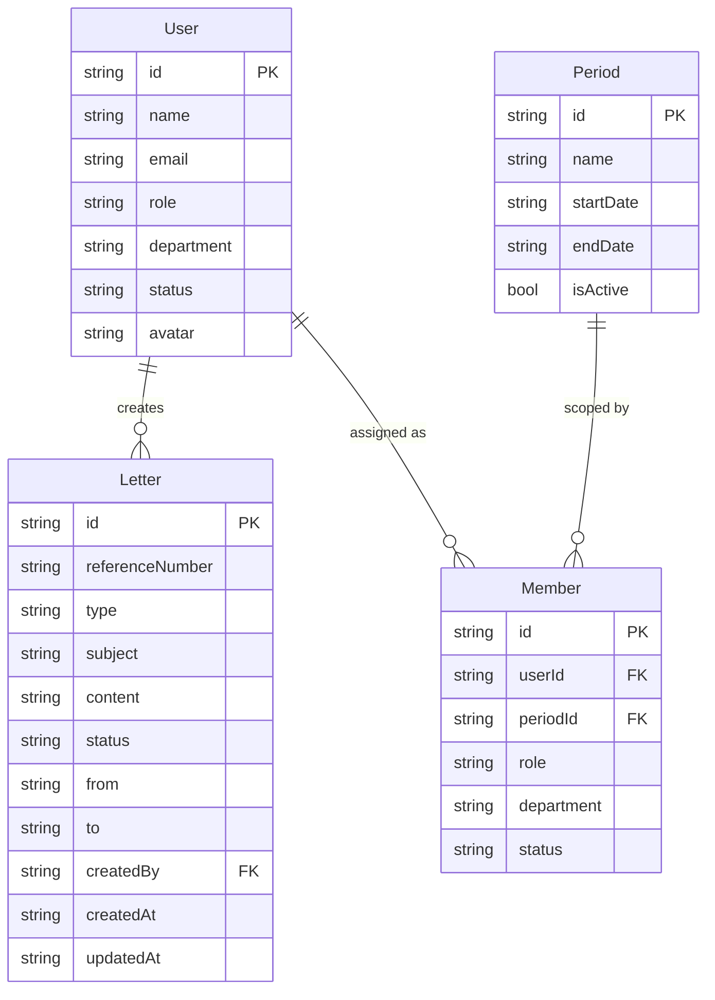

# Entity Relationship Diagram — MGSULBAR

Data model for the MGSULBAR surat menyurat application. **Logical model** is normalized (3NF); **physical implementation** uses two Google Sheets tabs (Users, Letters) with JSON columns for one-to-many data. Relationships are logical (no foreign-key enforcement in Sheets).

---

## 1. Normalized logical model (3NF)

### Entities and attributes

**User** (one row per user)

| Attribute   | Type   | Notes |
|------------|--------|-------|
| id         | string | PK |
| name       | string | |
| email      | string | Unique |
| role       | enum   | admin \| creator \| approver \| viewer |
| passwordHash | string | Not exposed in API |
| status     | enum   | pending \| active \| rejected — after register, status = pending; admin approves → active (can login). Optional: approvedAt, approvedById. |

**Period** (one row per period; used to scope pengurus for "current period")

| Attribute  | Type   | Notes |
|------------|--------|-------|
| id         | string | PK |
| name       | string | e.g. "2025–2028" |
| startDate  | string | ISO date |
| endDate    | string | ISO date |
| isActive   | bool   | e.g. one current period at a time |

**Department** (referenced in app for "where surat from")

| Attribute  | Type   | Notes |
|------------|--------|-------|
| id         | string | PK |
| name       | string | |
| periodId   | string | Optional FK → Period |

**Member / Pengurus** (assignment of User to department and position for a period)

| Attribute    | Type   | Notes |
|--------------|--------|-------|
| id           | string | PK |
| userId       | string | FK → User.id; only users with status = active may be assigned. |
| department   | string | or departmentId FK → Department |
| role         | string | position, e.g. Ketua, Sekretaris |
| periodId     | string | FK → Period |
| status       | enum   | e.g. active |
| name, email  | string | Optional denormalized for display |

**Constraint:** Only registered and approved users (User.status = active) can be assigned as members for a given period. Members are the source for "Dari", approvers, and tembusan.

**Letter** (one row per surat; references User via createdBy)

| Attribute       | Type   | Notes |
|----------------|--------|-------|
| id             | string | PK |
| referenceNumber| string | |
| type           | enum   | surat_keluar \| surat_keputusan \| proposal (current UI); surat_masuk, undangan, nota_dinas may be used in backend/sheet |
| subject        | string | |
| content        | string | |
| status         | enum   | LetterStatus (see below) |
| priority       | enum   | low \| normal \| high \| urgent |
| classification | enum   | public \| internal \| confidential \| secret |
| from           | string | |
| to             | string | |
| createdBy      | string | FK → User.id |
| createdAt      | string | ISO |
| updatedAt      | string | ISO |
| sentAt         | string | Optional |
| receivedAt     | string | Optional |
| dueDate        | string | Optional |
| eventDate      | string | Optional (undangan) |
| eventLocation  | string | Optional (undangan) |
| dispositionNote| string | Optional (surat masuk) |
| cc             | string | Stored as JSON array of strings |

**LetterStatus:** draft | pending_approval | approved | rejected | revision | sent | received | forwarded | archived

**ApprovalStep** (normalized: one row per step per letter)

| Attribute  | Type   | Notes |
|-----------|--------|-------|
| id        | string | PK |
| letterId  | string | FK → Letter.id |
| approverId| string | FK → User.id |
| order     | int    | |
| status    | enum   | pending \| approved \| rejected |
| comment   | string | Optional |
| decidedAt | string | Optional ISO |

**StatusHistory** (normalized: one row per change)

| Attribute  | Type   | Notes |
|-----------|--------|-------|
| id        | string | PK |
| letterId  | string | FK → Letter.id |
| status    | enum   | LetterStatus |
| changedById | string | FK → User.id |
| changedAt | string | ISO |
| comment   | string | Optional |

**Signature** (normalized: one row per signature)

| Attribute     | Type   | Notes |
|--------------|--------|-------|
| id           | string | PK |
| letterId     | string | FK → Letter.id |
| signedById   | string | FK → User.id |
| signatureDataUrl | string | |
| signedAt     | string | ISO |

**ForwardedTo** (normalized: many-to-many Letter–User for disposition)

| letterId | userId |
|----------|--------|
| string   | string |

**Notification** (optional; for approver/creator notifications)

| Attribute  | Type   | Notes |
|------------|--------|-------|
| id         | string | PK |
| userId     | string | FK → User.id (recipient) |
| letterId   | string | FK → Letter.id |
| type       | enum   | e.g. pending_approval, returned, approved, forwarded |
| readAt     | string | Optional ISO; null if unread |
| createdAt  | string | ISO |

**ApprovalStep.comment** — Use for "approve with notes" and "return with notes"; backend and UI should persist and display it.

---

## 2. Physical implementation (Google Sheets)

We use **Users**, **Letters**, **Members**, and optionally **Periods** and **Notifications** tabs. One-to-many and many-to-many data in Letter are stored as **JSON in the Letter row**; the backend parses and resolves user/member references at runtime.

| Sheet   | Row 1 (headers) | Rows 2+ | Normalization note |
|---------|------------------|---------|---------------------|
| **Users** | id, name, email, role, department, avatar, passwordHash, status, approvedAt, approvedById | One row per user | Add status (pending \| active \| rejected) for registration approval; optional approvedAt, approvedById. |
| **Periods** | id, name, startDate, endDate, isActive | One row per period | New tab; scope for "current period" pengurus. |
| **Members** | id, userId, name, role, department, email, status, periodId | One row per member assignment | Add userId (FK → Users.id), periodId (FK → Periods); only active users can be assigned. |
| **Letters** | id, referenceNumber, type, subject, content, status, priority, classification, from, to, createdAt, updatedAt, createdBy, sentAt, receivedAt, dueDate, eventDate, eventLocation, dispositionNote, attachments, approvalSteps, statusHistory, cc, signatures, forwardedTo, fromDepartment, … | One row per letter | Letter in 3NF plus JSON columns; approvalSteps (with comment), statusHistory, cc, forwardedTo. |
| **Notifications** | id, userId, letterId, type, readAt, createdAt | One row per notification | Optional tab; or derive from letter/status data in-app. |

- **createdBy** is a single User id (normalized).
- **approvalSteps**, **statusHistory**, **signatures**, **forwardedTo**, **attachments**, **cc** are stringified JSON in one cell per column.
- **Constraint:** Only users with status = active can be assigned as members (pengurus) for a period.

---

## 3. Creating the sheets in Google Sheet

The backend **creates the Users and Letters tabs automatically** when they are missing:

1. **On first data access:** Any API call that uses Google Sheets (e.g. GET /api/users, GET /api/letters, GET /api/dashboard/stats, POST /api/register, POST /api/login with sheet user) calls `ensureSheets()`. If the **Users** or **Letters** tab does not exist, it is created and the header row is written.
2. **Optional: trigger explicitly:** Call **GET /api/setup** (authenticated). The server ensures both tabs exist with the correct headers. Use this after creating a new spreadsheet and setting `SPREADSHEET_ID` in `server/.env`.

**Steps for a new Google Sheet:**

1. Create a new Google Sheet in Drive.
2. Share it with the **service account** email (from `GOOGLE_SHEETS_CREDENTIALS.client_email`) with **Editor** access.
3. Copy the spreadsheet ID from the URL: `https://docs.google.com/spreadsheets/d/<SPREADSHEET_ID>/edit`.
4. Set `SPREADSHEET_ID` in `server/.env`.
5. Start the backend and either log in (dashboard) or call GET /api/setup once; the **Users** and **Letters** tabs will be created with the headers above.

---

## 4. Relationships (logical)

| From   | To     | Relationship   | Description |
|--------|--------|----------------|-------------|
| Letter | User   | many-to-one    | Letter.createdBy → User.id |
| Letter | User   | (via JSON)     | approvalSteps[].approverId, statusHistory[].changedById, signatures[].signedById, forwardedTo[] user ids |
| User   | —      | status         | pending (after register) → active (after admin approval) → can login; only active users can be assigned as Member. |
| Period | Member | one-to-many    | Member.periodId → Period.id; pengurus for "current period". |
| User   | Member | one-to-many    | Member.userId → User.id; only User.status = active. |

Resolved at runtime in `server/services/letters.js` (e.g. `usersMap`, `approverMap` from users + members).

---

## 5. Diagram (Mermaid)

See [erd-diagram.mmd](erd-diagram.mmd) for the raw Mermaid file.
