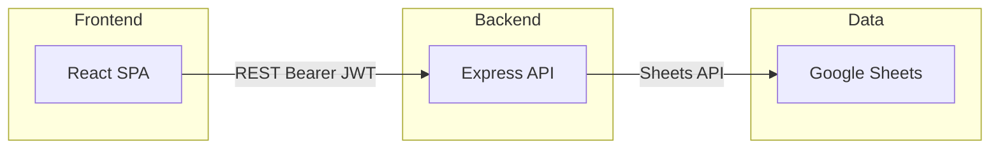

# Software Requirements Specification — MGSULBAR

Functional and non-functional requirements, system overview, and interfaces for the MGSULBAR surat menyurat application. Traceability: each FR/NFR references [master-plan.md](master-plan.md) use cases and [prd.md](prd.md) features where applicable.

---

## 1. Introduction

**Purpose:** Define software requirements for MGSULBAR so that development, testing, and acceptance are consistent and traceable.

**Scope:** Web application (React frontend, Node.js backend, Google Sheets as data store) for sekretariat letter/mail management: dashboard, outbox/drafts/approvals/archive, create letter, list users. **Current build:** no auth in routes; frontend uses mock data. Auth and full API integration are target phase.

**Definitions / acronyms:**

- **Surat:** Letter or mail (surat keluar, surat keputusan, proposal in current UI).
- **JWT:** JSON Web Token (session).
- **API:** REST API exposed by the backend (`/api/*`).
- **Sheets:** Google Sheets (tabs Users, Letters).

---

## 2. System overview

- **Frontend:** React (Vite, TypeScript), single-page app. **Current routes:** `/`, `/outbox`, `/drafts`, `/approvals`, `/archive`, `/create`, `/awardees`, `/programs`, `/finance`, `/members`, `*`. **Current data:** mock data (`mockData.ts`, `letterTemplates.ts`); no login in app. **Target:** Auth via JWT; API client sends `Authorization: Bearer <token>`; routes for login, register, and protected pages.
- **Backend:** Node.js (Express), serves `/api/*`; auth middleware validates JWT; reads/writes Google Sheets via service account (used when frontend is wired to API).
- **Data:** **Current:** Mock in frontend. **Target:** Google Sheets with tabs **Users** and **Letters**; structure per [erd.md](erd.md).

---

## 3. Functional requirements

**Current implementation:** Dashboard, Outbox, Drafts, Approvals, Archive, Create letter, and placeholder pages (Awardees, Programs, Finance, Members) use **mock data**; no login/register in app. The requirements below describe **target** behavior when auth and API are wired. FR-1–FR-4 (Auth) are not implemented in current routes; FR-5–FR-9 are satisfied by mock data in current build.

### Auth (target)

| ID | Requirement | Master plan | API / UI |
|----|-------------|-------------|----------|
| FR-1 | System shall allow login with email and password. Admin login via env (ADMIN_EMAIL, ADMIN_PASSWORD); other users via Users sheet (email + bcrypt passwordHash). | UC-1 | POST /api/login; LoginPage |
| FR-2 | System shall allow registration with name, email, and password. New user stored in Users sheet with role viewer; password hashed (bcrypt). | UC-2 | POST /api/register; RegisterPage |
| FR-3 | System shall maintain session via JWT (7d expiry). Protected routes require valid Bearer token; GET /api/me returns current user. | UC-1, UC-3 | Authorization header; AuthContext; GET /api/me |
| FR-4 | System shall support roles: admin, creator, approver, viewer. Role stored in Users sheet (and admin from JWT). Enforcement of role-based access (e.g. only approver can approve) may be added in future. | Governance | req.user.role; UserRole in types |

### Letters

| ID | Requirement | Master plan | API / UI |
|----|-------------|-------------|----------|
| FR-5 | System shall list letters for outbox (surat_keluar, surat_keputusan, proposal), drafts (status draft), approvals (status pending_approval), archive (status archived/sent). Filtering by status is applied in frontend. **Current:** mockData (getOutboxLetters, getDraftLetters, getPendingApprovalLetters, mockLetters filter). | UC-4 | GET /api/letters (target); OutboxPage, DraftsPage, ApprovalsPage, ArchivePage |
| FR-6 | System shall allow creating and updating letters. Create: POST /api/letters (id generated if omitted). Update: PATCH /api/letters/:id. | UC-6, UC-7, UC-8 | POST /api/letters; PATCH /api/letters/:id; CreateLetterPage |
| FR-7 | System shall allow viewing letter detail by id. | UC-5 | GET /api/letters/:id; LetterDetailDialog |
| FR-8 | System shall provide dashboard statistics: inbox count, outbox count, drafts count, pending/awaiting approval count. | UC-3 | GET /api/dashboard/stats; Dashboard |

### Users

| ID | Requirement | Master plan | API / UI |
|----|-------------|-------------|----------|
| FR-9 | System shall list users (id, name, email, role, department) for selection (e.g. approver, penerima). No passwordHash in response. | UC-10 | GET /api/users; CreateLetterPage (dropdown) |

---

## 4. Non-functional requirements

| ID | Requirement |
|----|-------------|
| NFR-1 | **Security:** Passwords hashed with bcrypt; session via JWT (signed with JWT_SECRET). In production, HTTPS and secure env for ADMIN_EMAIL, ADMIN_PASSWORD, JWT_SECRET. |
| NFR-2 | **Availability:** Backend and frontend deployable independently (e.g. Render); Google Sheets API availability applies to data access. |
| NFR-3 | **Usability:** UI labels and main messages in Indonesian; responsive layout (sidebar adapts for mobile). |
| NFR-4 | **Data persistence:** Users and Letters persisted in Google Sheets; backend ensures tabs and headers exist (ensureSheets). |

---

## 5. Interfaces

### REST API

- **Base URL:** Configurable (e.g. `http://localhost:3001` for dev; frontend uses `VITE_API_URL`).
- **Auth:** For protected routes, client sends `Authorization: Bearer <JWT>`.
- **Content-Type:** `application/json` for request/response bodies.

**Endpoints (summary):**

| Method | Path | Auth | Description |
|--------|------|------|-------------|
| GET | /api/health | No | Health check; returns { ok, timestamp }. |
| POST | /api/login | No | Body: { email, password }. Returns { token, user } or 401. |
| POST | /api/register | No | Body: { name, email, password }. Returns { token, user } or 400/409. |
| GET | /api/me | Yes | Returns current user or 401/403. |
| GET | /api/setup | Yes | Ensures Users and Letters tabs exist in the spreadsheet (creates them if missing). Returns { ok, message } or 503/500. |
| GET | /api/users | Yes | Returns list of users (no passwordHash). |
| GET | /api/dashboard/stats | Yes | Returns { inbox, outbox, drafts, pendingApproval, awaitingMyApproval }. |
| GET | /api/letters | Yes | Returns all letters (array). |
| GET | /api/letters/:id | Yes | Returns one letter or 404. |
| POST | /api/letters | Yes | Body: letter payload. Returns created letter (201). |
| PATCH | /api/letters/:id | Yes | Body: partial letter. Returns updated letter or 404. |

Implementations: `server/routes/api.js`, `src/lib/api.ts`.

### Google Sheets

- **Tabs:** Users, Letters (created automatically with headers if missing).
- **Users columns:** id, name, email, role, department, avatar, passwordHash.
- **Letters columns:** id, referenceNumber, type, subject, content, status, priority, classification, from, to, createdAt, updatedAt, createdBy, sentAt, receivedAt, dueDate, eventDate, eventLocation, dispositionNote, attachments, approvalSteps, statusHistory, cc, signatures, forwardedTo.
- **Access:** Backend uses service account credentials (GOOGLE_SHEETS_CREDENTIALS, SPREADSHEET_ID). See [erd.md](erd.md) for data model.
